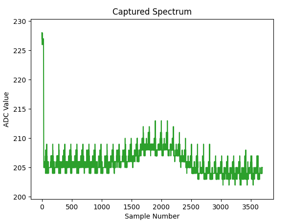
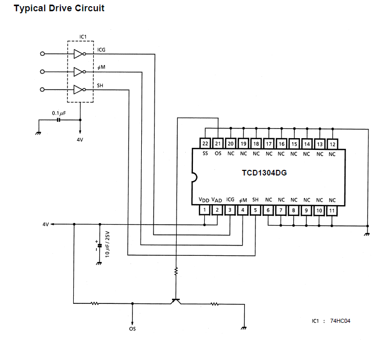
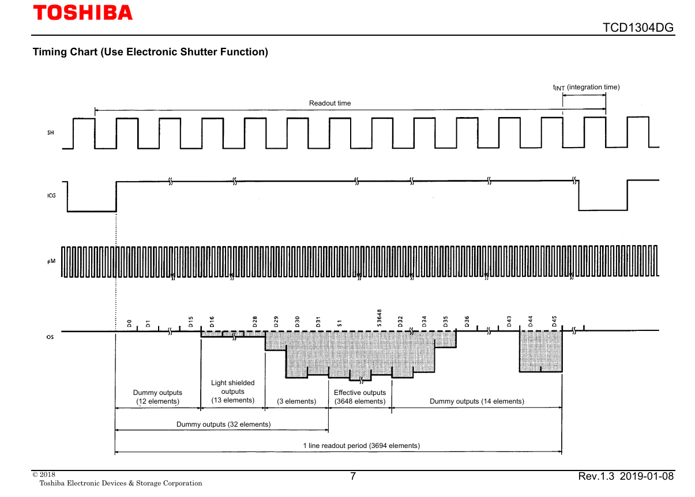

# Work in Progress!!

## [TCD1304](https://toshiba.semicon-storage.com/us/semiconductor/product/linear-image-sensors/detail.TCD1304DG.html) with Raspberry Pi Pico

This project implements a simple TCD1304 CCD driver using the Raspberry Pi Pico microcontroller. The TCD1304 is a 3648-pixel linear CCD sensor, and the Raspberry Pi Pico is a dual-core Cortex M0 microcontroller with a built-in 500 ksps ADC.

To view the captured spectrum, upload the compiled UF2 file from `TCD1304.c`, and then run `plot.py` to visualize the data received via the USB serial port.

The image below shows the spectrum captured from the TCD1304 with a 100 µs integration time and averaging over 10 frames. The spectrum is inverted on the y-axis, meaning low photon count corresponds to high ADC values. The peak in the middle of the spectrum is due to a shadow on the CCD detector.

## Hardware Setup

This project utilizes the typical drive circuit from the TCD1304 datasheet, excluding the use of the 74HC04 Hex inverter.

## Timing

The RP2040's ADC operates at 500 ksps, capturing data via DMA, which synchronizes with the 2 MHz Master Clock (MC) of the TCD1304. The integration time (Shift Gate cycle) is currently set to 100 µs, while the full 3648-pixel readout time is approximately 80 ms.

Current timing provides basic functionality, but the stability of the signal is not ideal due to the unsynchronized nature of SH, ICG, and MC. Additionally, the ADC capability of the Raspberry Pi Pico limits the readout quality, providing only 8-bit resolution at 500 ksps with DMA.

## To Do

- Use the second core to handle output work.
- Use IRC to fine-tune the SH and ICG signals.
- Implement RTOS for better timing control.
- Consider using a different microcontroller with a better ADC, such as the STM32 family.
